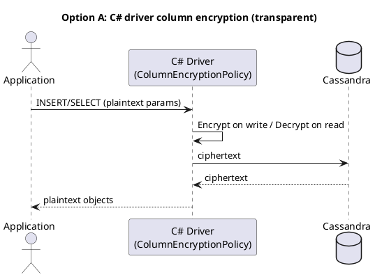
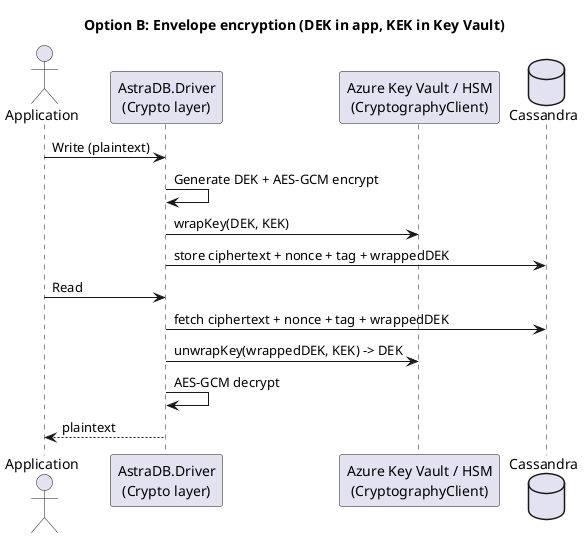
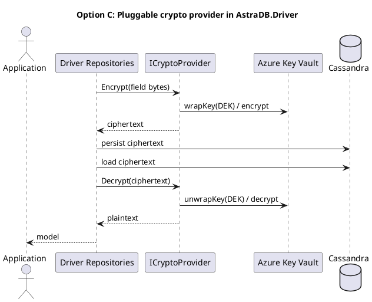

# 🔐 Field / Payload Encryption in `DataStax.AstraDB.Driver` (.NET, Azure-first)

This page documents possible approaches for handling **field-level (payload) encryption and decryption** inside the custom `DataStax.AstraDB.Driver` package. The goal is to ensure sensitive data is protected end-to-end while allowing flexibility in searchability, compliance, and key management.

---

## Option A — C# Driver Column Encryption (transparent)

The DataStax C# Driver provides **built-in column encryption** that can be enabled through an **encryption policy**. This allows fields to be encrypted automatically on write and decrypted on read. Application code interacts with plaintext objects; the driver handles the crypto transparently.

### Key Points
- Encryption policies are attached with `WithColumnEncryptionPolicy(...)`.  
- `AesColumnEncryptionPolicy` allows per-column configuration:  
  - **Deterministic encryption** (static IV) → required for searchable columns (equality queries, PKs).  
  - **Non-deterministic encryption** (random IV) → stronger secrecy, not searchable.  
- Keys are provided as base64-encoded AES keys (128/192/256-bit).  
- Supported in **prepared statements** transparently; **simple statements** must use `EncryptedValue`.

### Example Flow


### Example Code
```csharp
var key = Convert.FromBase64String("<BASE64_AES_KEY>");
var iv  = Convert.FromBase64String("<BASE64_STATIC_IV>");

var det = new AesColumnEncryptionPolicy.AesKeyAndIV(key, iv);  // deterministic
var rnd = new AesColumnEncryptionPolicy.AesKeyAndIV(key);      // randomized IV

var policy = new AesColumnEncryptionPolicy();
policy.AddColumn("ks", "customers", "email", det, ColumnTypeCode.Text);
policy.AddColumn("ks", "customers", "secret_note", rnd, ColumnTypeCode.Text);

var cluster = Cluster.Builder()
    .AddContactPoint("127.0.0.1")
    .WithColumnEncryptionPolicy(policy)
    .Build();

var session = await cluster.ConnectAsync();
```

🔗 Reference: [DataStax C# Driver – Column Encryption](https://docs.datastax.com/en/developer/csharp-driver/latest/features/security/column-encryption/)

---

## Option B — Envelope Encryption (DEK/KEK with Azure Key Vault / Managed HSM)

Envelope encryption provides **application-managed control** by separating **data encryption keys (DEKs)** from **key encryption keys (KEKs)**. The package can generate a DEK for encrypting payloads with AES-GCM, and use **Azure Key Vault or Managed HSM** to wrap/unwrap the DEK with a KEK.

### Key Points
- **DEK**: Symmetric AES-256 key, generated per record or per session.  
- **KEK**: Asymmetric or HSM-backed key in Azure Key Vault. Used only to wrap/unwrap the DEK.  
- Data stored in Cassandra: `ciphertext + nonce + tag + wrappedDEK`.  
- Allows **auditable key use**, **rotation** of KEKs without re-encrypting all data, and **compliance alignment**.

### Example Flow


### Example Code
```csharp
var client = new CryptographyClient(new Uri("<kek-id>"), new DefaultAzureCredential());

// Generate DEK
var dek = RandomNumberGenerator.GetBytes(32);
var nonce = RandomNumberGenerator.GetBytes(12);

// Encrypt field
var plain = Encoding.UTF8.GetBytes("sensitive");
var cipher = new byte[plain.Length];
var tag = new byte[16];
using (var aes = new AesGcm(dek))
    aes.Encrypt(nonce, plain, cipher, tag);

// Wrap DEK with KEK in Key Vault
var wrapped = client.WrapKey(KeyWrapAlgorithm.RsaOaep256, dek);
```

🔗 References:  
- [Azure Key Vault – CryptographyClient](https://learn.microsoft.com/en-us/dotnet/api/azure.security.keyvault.keys.cryptography.cryptographyclient)  
- [Azure Key Vault Key Management](https://learn.microsoft.com/en-us/azure/key-vault/keys/about-keys)

---

## Option C — Pluggable Crypto Provider (extensible)

Instead of hardcoding encryption logic, the driver package can expose an **`ICryptoProvider` interface**. This abstraction allows:  
- Default implementation using **Azure Key Vault**.  
- Flexibility to swap in other libraries or KMS systems.  
- Support for both **deterministic** (searchable) and **non-deterministic** modes.

### Key Points
- Keeps driver repository logic separate from crypto operations.  
- Makes it easier to adapt to compliance changes.  
- Allows community or internal teams to extend with different providers.  

### Example Flow


### Example Interface
```csharp
public interface ICryptoProvider
{
    (byte[] cipher, byte[] nonce, byte[] tag, byte[] wrappedDek) Encrypt(byte[] plain);
    byte[] Decrypt(byte[] cipher, byte[] nonce, byte[] tag, byte[] wrappedDek);

    // Optional: deterministic methods for searchable fields
    byte[] DeterministicEncrypt(ReadOnlySpan<byte> plain);
    byte[] DeterministicDecrypt(ReadOnlySpan<byte> cipher);
}
```

### Libraries to Consider
- **System.Security.Cryptography**  
  - Built into .NET, no extra dependencies.  
  - Provides AES (CBC/GCM), RSA, ECDSA, hashing.  
  - Recommended default for symmetric/asymmetric primitives.  
  - [System.Security.Cryptography Documentation](https://learn.microsoft.com/en-us/dotnet/api/system.security.cryptography)

- **SecurityDriven.Inferno**  
  - Opinionated library focused on **modern, safe defaults**.  
  - Wraps `System.Security.Cryptography` with best-practice patterns (AES-GCM, PBKDF2, HMAC).  
  - Reduces risk of misusing low-level APIs.  
  - [GitHub – SecurityDriven.Inferno](https://github.com/sdrapkin/SecurityDriven.Inferno)

- **BouncyCastle**  
  - Comprehensive library with **wide algorithm coverage** (PGP, PKCS standards, curves).  
  - Suitable if uncommon formats/algorithms are required.  
  - More low-level and complex API.  
  - [BouncyCastle C#](https://www.bouncycastle.org/csharp/)

---

## 🔎 Comparison Matrix

| Feature / Criteria          | Option A – Driver Column Encryption | Option B – Envelope Encryption (Azure Key Vault) | Option C – Pluggable Crypto Provider |
|-----------------------------|-------------------------------------|-------------------------------------------------|--------------------------------------|
| **Transparency**            | Fully transparent to application   | Requires crypto logic in driver package         | Transparent via provider abstraction |
| **Searchable fields**       | Deterministic encryption supported | Possible with custom deterministic scheme       | Possible if provider supports it     |
| **Key Management**          | Static keys (manual rotation)      | KEKs managed by Key Vault / HSM (rotation, audit) | Flexible (Key Vault, Inferno, BouncyCastle, etc.) |
| **Compliance / Audit**      | Limited                            | Strong (Key Vault logs, HSM-backed)             | Depends on provider implementation   |
| **Complexity**              | Low (configure policy)             | Medium (envelope pattern integration)           | Medium–High (provider design, multiple libs) |
| **Best Use Case**           | Quick adoption, minimal setup      | Regulated workloads needing audit + rotation    | Long-term extensibility and flexibility |

---

## ✅ Final Recommendations

- Use **Option A** for quick adoption and transparent encryption/decryption.  
- Adopt **Option B** when regulatory compliance, KMS integration, or auditable key usage is required.  
- Design **Option C** into the package for long-term flexibility, with `System.Security.Cryptography` as the baseline, `SecurityDriven.Inferno` for modern safe patterns, and `BouncyCastle` for advanced/legacy algorithms.  
